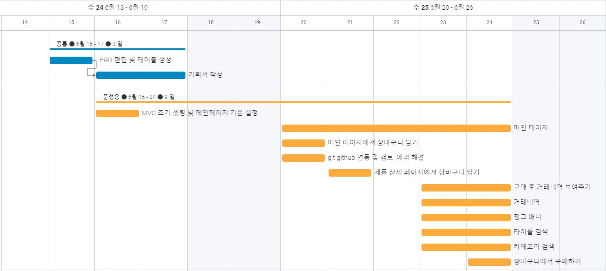
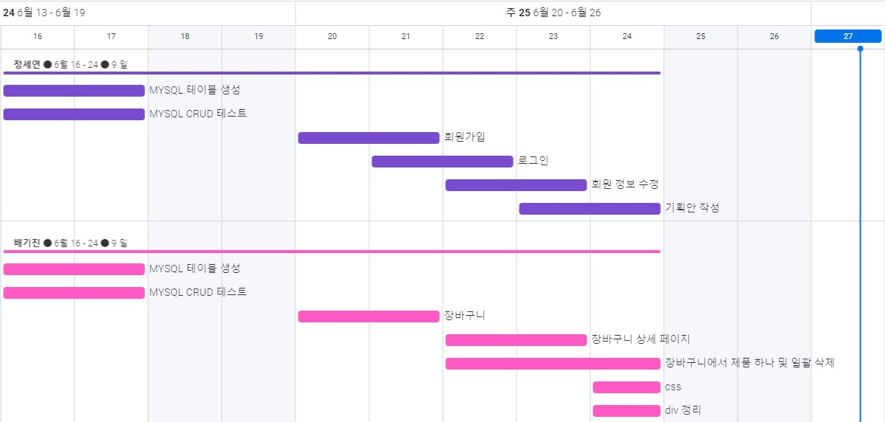
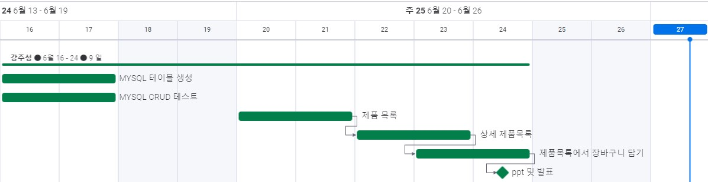
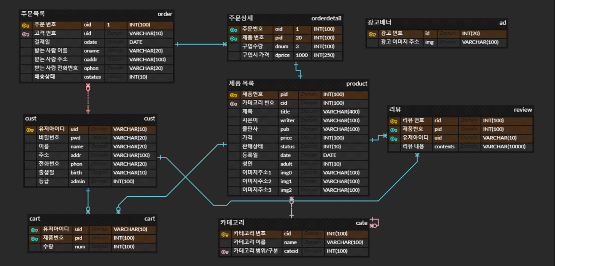

# READM.MD

# 역할 분담

문성용 : 초기 MVC 셋팅, 메인 페이지, 타이틀 검색, 카데고리 검색,  제품 상세에서 장바구니 담기, 장바구니에서 구매하기, 구매 후 거래내역 보여주기, 거래내역, 광고 배너

정세연 : 회원가입, 로그인, 회원 정보 수정, 기획안 작성

배기진 : 장바구니, 장바구니 상세 페이지, 장바구니에서 일괄 삭제, css, div 정리

강주성 : 제품목록, 상세 제품목록, 제품목록에서 장바구니 담기, ppt 및 발표
---

# 개발환경

## 툴

- Eclipse IDE for Enterprise Java and Web Developers - 2022-03
- MySQL Workbench 8.0CE

# 언어

- Java 8
- thymeleaf
- JavaScript ( jQuery, Ajax )

## 프레임 워크

- Spring Boot Maven
- MyBatis 2.2.2
- BootStrap

# 데이터베이스

- MySQL 8.0.29-0ubuntu0.22.04.2
- Ubuntu 22.04 LTS 22.04

# 기타

# 스케줄(09:00 ~ 18:00) 1day 8th

# ERD 설계
